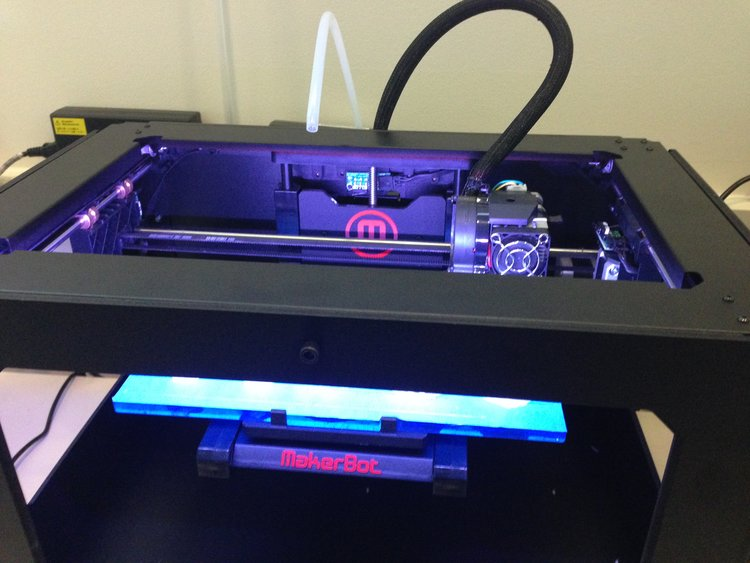
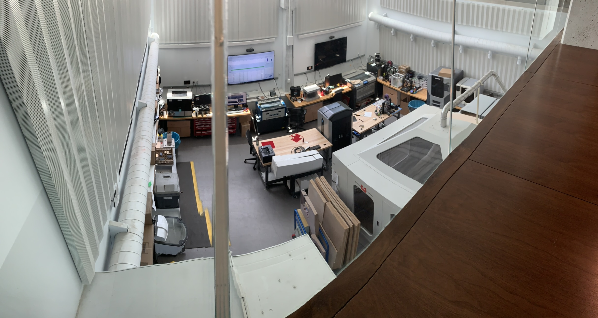

#### Teammates:
Georgia Crowther, Paul Chang, Oliver Kliewe
#### Professor:
Robert Shepherd

## Summary

[RPL Website](https://cornellrpl.wixsite.com/cornellrpl)

Co-founded the RPL at Cornell for the engineering community to have a resource that would support projects of all kinds. A friend and I got together and worked with a few faculty to source 3D printers and a laser etcher that were not in active use at the time. We moved them all to one location and started printing. It started out small with project teams coming to us for help, but as we increased resources, the user-base increased exponentially. We put together a team of students that supported the lab, made a scheduler to coordinate jobs, and ensured all machines were running constantly and without downtime. That last bit was the crucial benefit as previously the 3D printers being used were down half the time due to user error or bugs with the system. The RPL still exists today in its new home in the recently renovated Upson Hall (Mechanical and Aerospace Engineering Hall) where it occupies two stories and has expanded greatly. Still working on tracking down more photos.

During my tenure at the lab, from founding through the first year of operation, we went through significant revisions, but we had 2 Up! Plus 2's [FFF], 2 CubeX Duos [FFF], a Stratasys Dimension [FDM], 2 Makerbot Replicators [FDM], an Objet 30 [polyjet], and a laser cutter. The room was renovated to be more suited to the needs of the printers based on our input, alleviating thermal and chemical concerns. During this time I worked extensively with the student population, from classes, research groups, personal projects, and project teams, to advise and guide the design of their prototypes. I grew a lot in this lab and gained a deep appreciation for solid modeling and intelligent rapid prototyping.

## Photos

*Fig. 1: One of the few photos I have from the original lab. The lab itself was only about 200sq. ft. and was hidden away in a dark corner of the engineering campus.*

*Fig. 2: The RPL today, 2019, the lab has come a long way since we first got it off the ground*

## Videos
(Click through to Youtube)

*UP printers going full steam after days of debug*
