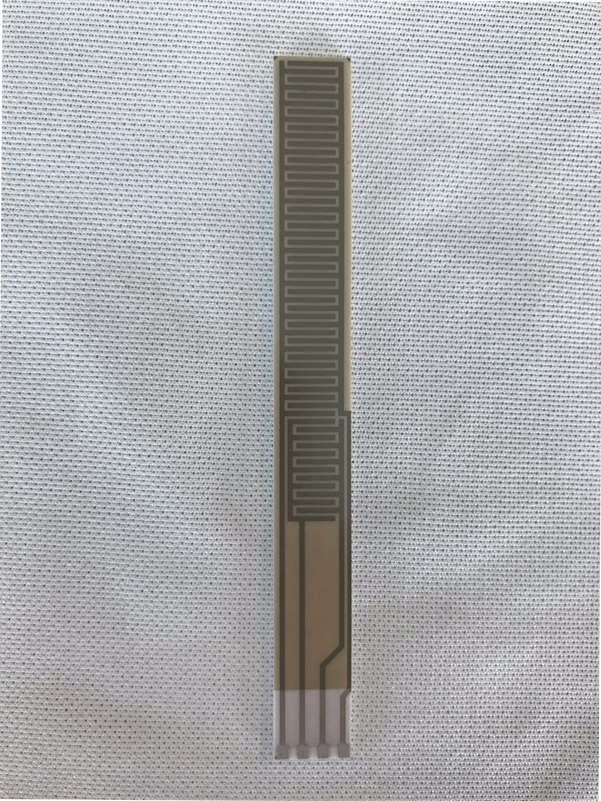

#### Title
Mechanical Design Engineer, Advanced Technologies
Lead Process Design Engineer, Advanced Technologies

## Summary

During my last year at Sensata I worked on new technology development to monitor a few key aspects of vehicle health in autonomous vehicles to match the market growth needed for the electric/autonomous vehicle disruption. My responsibilities primarily surrounded package development, sensor design and manufacture for these products, and ensuring that the unique challenges posed by the technology can be solved in full scale production.

## Patent
Filed, under NDA.

## Skills

Solidworks, coating development and process control, prototype sample builds on short timelines, use of SLA components in high stress environments, short turn machined samples, prototype assembly process, endcapping with silane deposition, technical screen-printing

## Photos

*Fig. 1: I developed a laser ablation method to subtractively manufacture electrode patterns on gold thick film deposited substrates for same day iteration. We also made full circuit layouts using this method.*

*Fig. 2: Reflection of me in front of a plasma cleaner (corona treatment), many hours were spent here dialing in the process. Plasma cleaner used to prepare glass surface for silane deposition.*

*Fig. 3: Evaluating various fluorinated silanes on glass test samples.*

*Fig. 4: Completed substrate with electrode patterns visible through deposited glass.*
