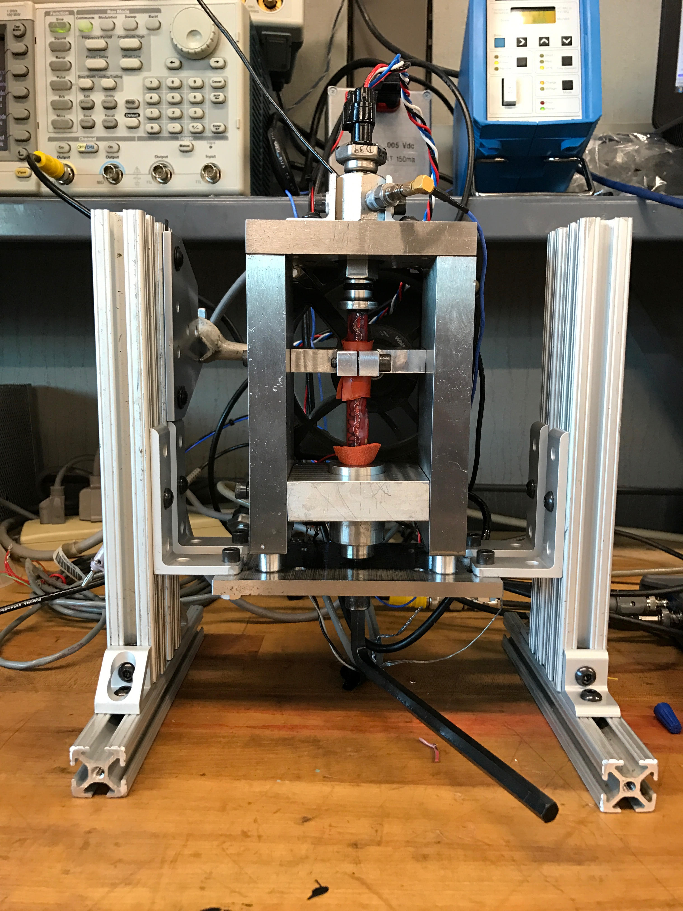

## Summary

I developed a system of pressure cycling that would enable me to high speed pressure cycle far in excess of the expected pressure cycling frequencies. Most pressure cycling at Sensata took place <10 Hz, but the cycler I built was capable of cycling at up to 5kHz. Taking a test that could normally take over a year to run and condensing it down to a single day. A customer approached us with a test that would require 400M cycles. Normally this test would take years to run, and so to save millions of dollars in NRE, I developed this cycler.

As an expansion, I was able to run mechanical resonant frequency analysis using the piezo actuator, which enabled Sensata, for the first time, to mechanically characterize the frequency response of a sensor and generate useful data of their true transfer function.

## Photos

*Fig. 1: Full system in use, visuals of the oscilloscopes, amplifier, electromechanical-fluidic system, and the key innovation of a fluid accumulator that would bleed small amounts of fluid into the system via a repurposed snubber as fluid leaked past the dynamic piston seal.*

*Fig. 2: Close-up of pressure cycler interface, a 120um displacement piezo-resistive stack was used to mechanically actuate a piston. The piston would repeatedly compress a small volume of fluid which the pressure sensor under test and the Kistler reference pressure would simultaneously read"
