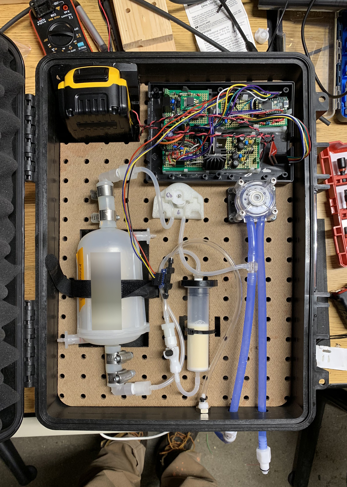
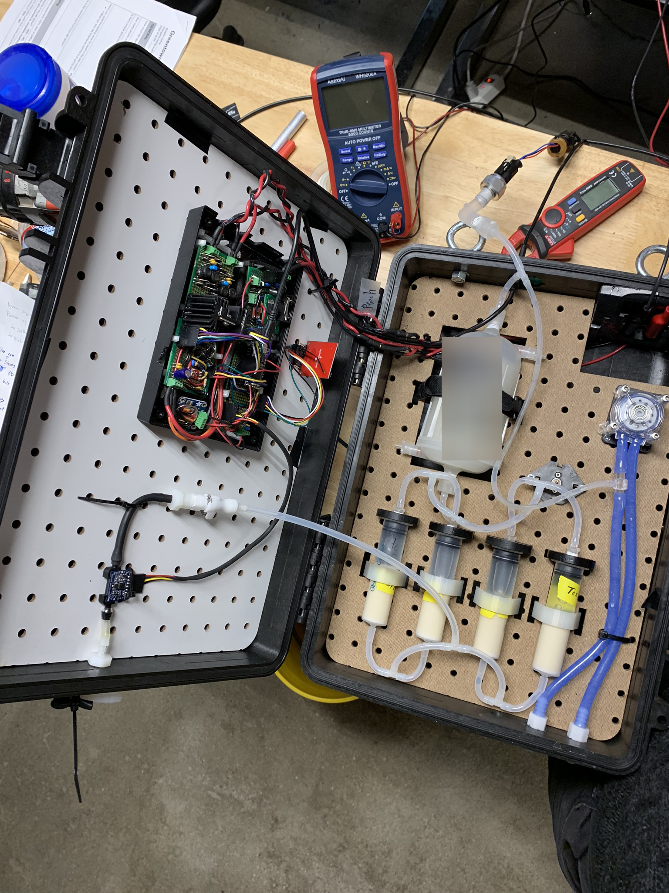
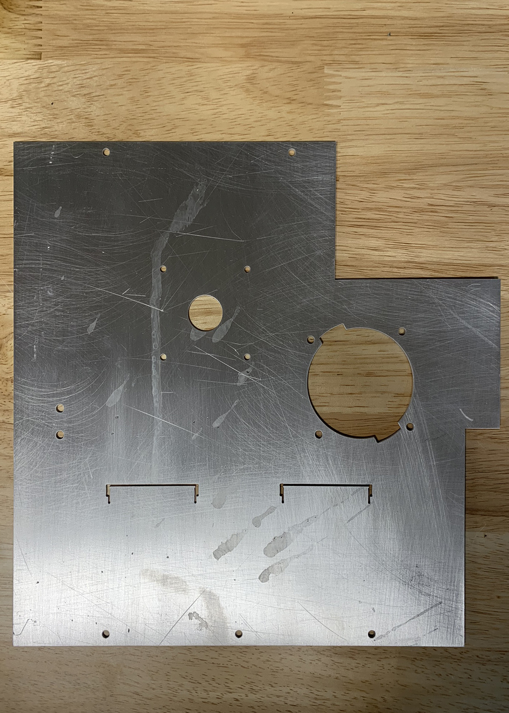

#### Title
Hardware Engineer

## Summary

Over my 10 months in Biobot the focus on my work was a pumping instrument that pumped wastewater out of a catchment and into the filtration devices. A new development, the product was an exercise in whitesheet design to be the cheapest, most robust, and most flexible design. Through the development process, 6 Design Reviews were held focusing on both technical and user interface needs. The final deliverable was 15 Gamma revision units, and a prototype developed with an IoT, cellular enabled device and successful tests of this device in the field. All technical metrics were hit or exceeded during development including: under consumption of battery life, communication from within a manhole, and precise sampling volumes.

## Patent
Filed, under NDA.

## Skills

project management, fluids, electromechanical assembly, IoT, cellular communication, battery management, prototype assembly, crimping, wiring, harness design, dc motor pumps, pressure evaluation, tubing and tubing routing, laser cutting, sheet metal design, CAD, box development, antenna evaluation

## Photos

*Fig. 1: Alpha1 revision unit internals, pegboard scraps from lab build used as backing plate. Electronics prototyped on protoboard.*

*Fig. 2: Alpha2 revision unit showing additional chemical filters and flow sensor integration.*

*Fig. 3: Beta device with hand bent aluminum mounting plate, early style acrylic plate, and Samtec connectors on isolated electronics box*

*Fig. 4: Unbent aluminum plate back from waterjet*

*Fig. 5: Gamma device in use, notable details in manufacturability since beta build: simplification of electronics box, revision of refreshment plate to aid in installation ease, manufacturer provided Al backing plate, simplified external diagnostics plate*

*Fig. 6: External diagnostics plate, gamma revision*

*Fig. 7: Manual reflow of diagnostic PCB*
