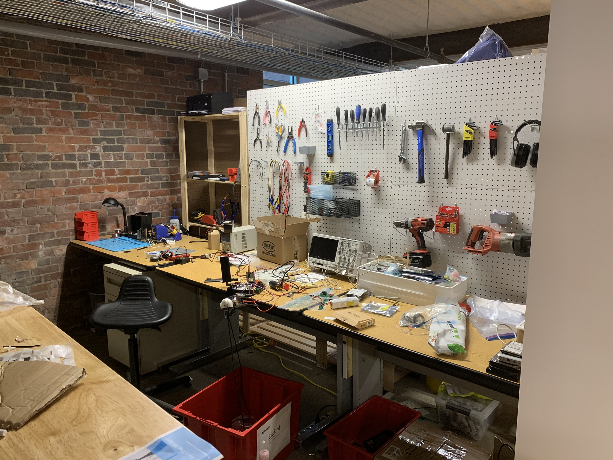
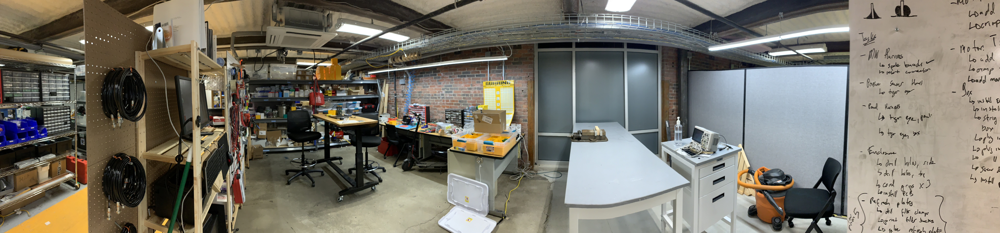
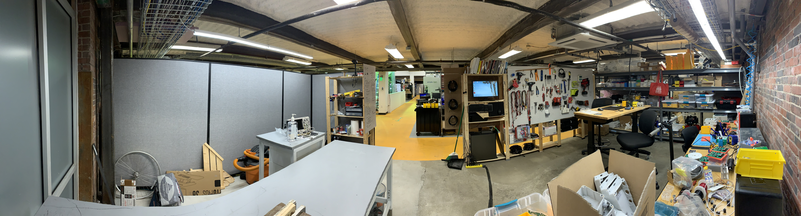
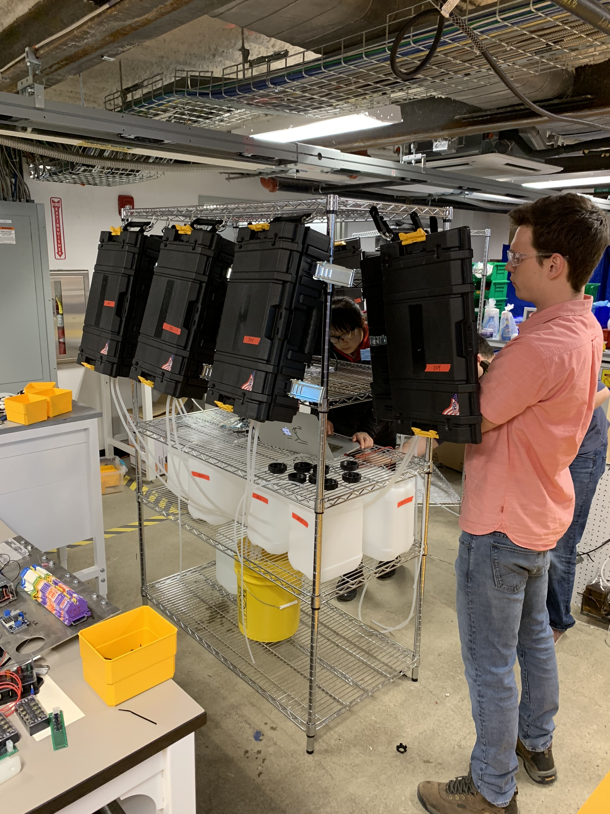

## Roles
Builder

## Summary

Starting at Biobot the lab was a few stainless benches designed purely for box refreshment. Without any tools to build, I took responsibility of building out a prototyping lab, reminiscent of a makerspace.

## Photos

*Fig. 1: Rev 1 of the lab, approximately 200 sq. ft, sort of a prototyping closet. Electronics lab bench, with some space for hardware assembly.*

*Fig. 2: Rev 3 of the lab, approximately 300 sq. ft. All tables sourced for free, waiting for the right opportunity to snag tables being given away and networking. Additional lighting added to build easier and faster.*

*Fig. 3: Rev 3, different view. Computer stand built by our intern, used for CAD and shared McMaster order.*

*Fig. 4: Testing stand for bulk testing of 8 boxes at a time. Used to conduct longevity and lifetime testing. (intern in foreground + electrical engineer in background)*

## Videos

*Video showing final version of lab as built by Matt, Rob, and I.*
