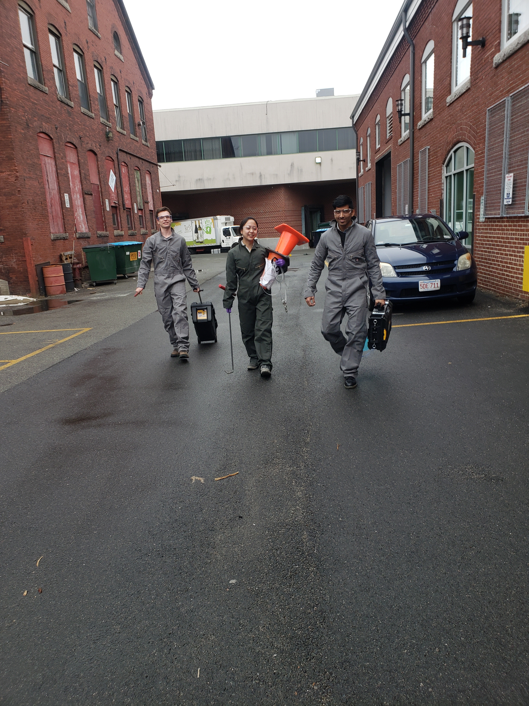
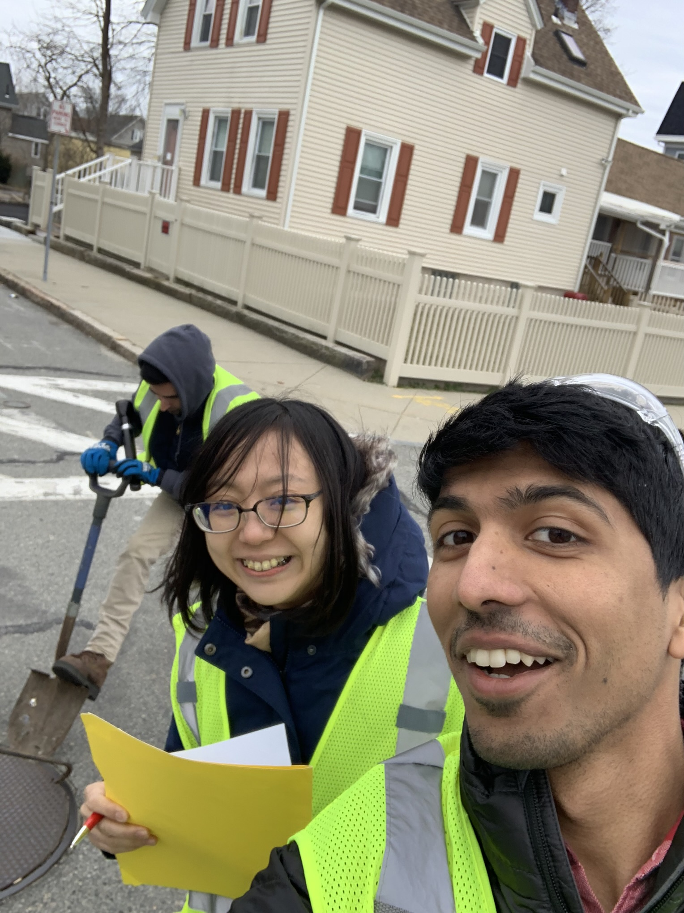
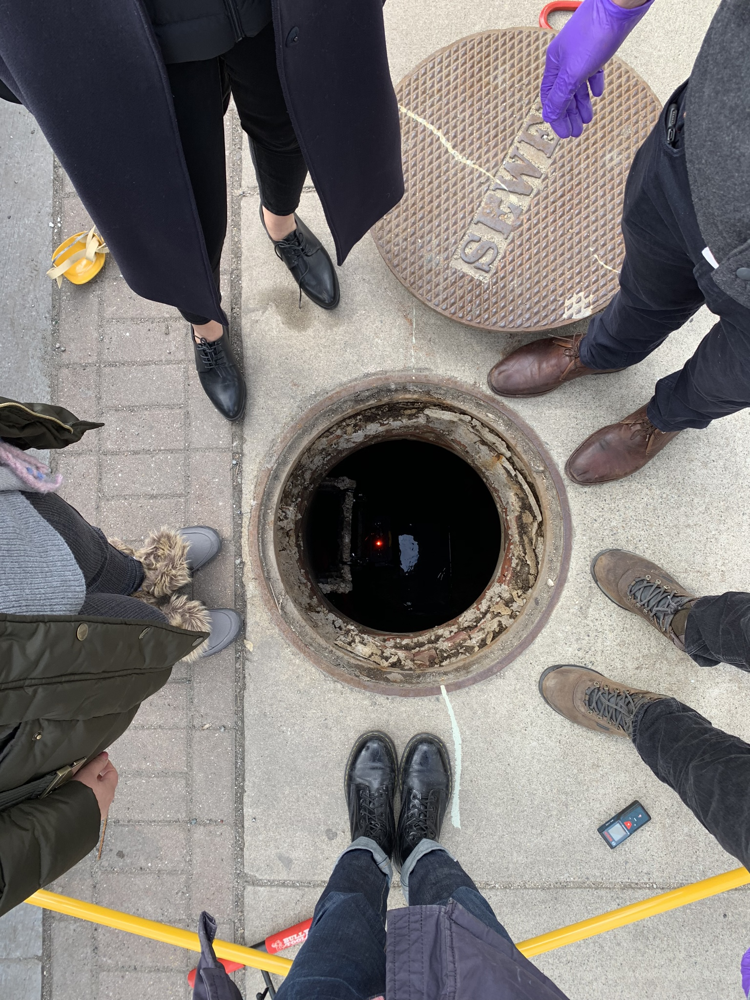

## Summary

Conducted a number of field excursions in New Bedford, MA, Somerville, MA, and Cambridge, MA. Totally unexperienced in field work prior to Biobot, but developed methodologies for fast and efficient surveying and deployment.

## Photos

*Fig. 1: Deployment squad, with a Beta box. Pictured: me, Project Manager Dr. Noriko Endo, and Intern Matt Murphy. Field uniforms also designed by me, critical to maintain cleanliness during sewer sampling but not appear to be frightening it standard hazmat gear*

*Fig. 2: New Bedford deployment shot.*

*Fig. 3: Rev 3, different view. Computer stand built by our intern, used for CAD and shared McMaster order.*

*Fig. 4: Manhole at 444 Somerville Ave, in front of the office, with box deployed and functioning.*
