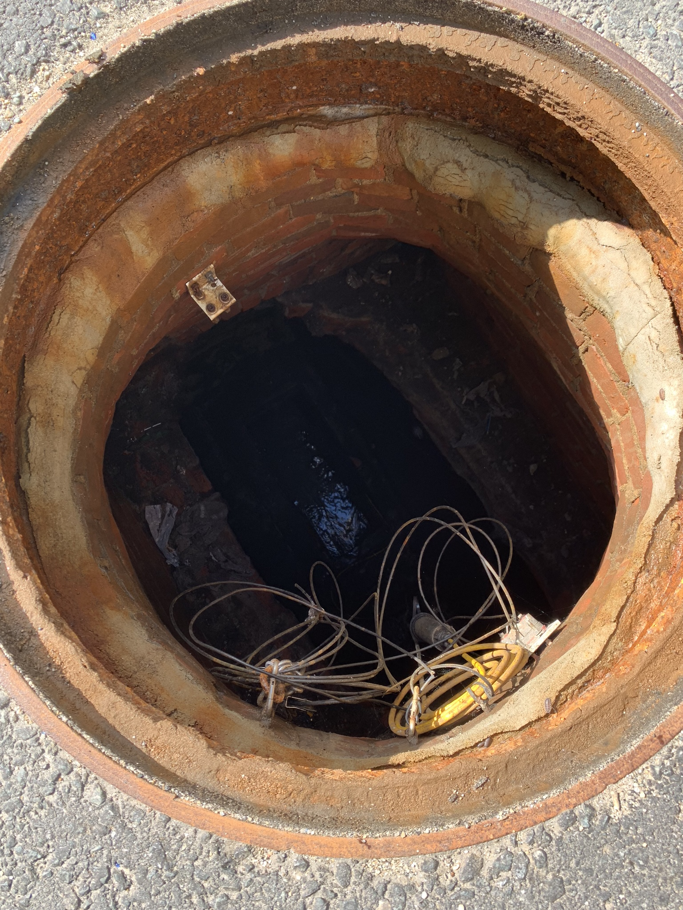

## Summary

Conducted a number of field excursions in New Bedford, MA, Somerville, MA, and Cambridge, MA. Totally unexperienced in field work prior to Biobot, but developed methodologies for fast and efficient surveying and deployment.

## Photos

*Fig. 1: Deployment squad, with a Beta box. Pictured: me, Project Manager Dr. Noriko Endo, and Intern Matt Murphy. Field uniforms also designed by me, critical to maintain cleanliness during sewer sampling but avoid public panic. Standard hazmat gear and vinyl coverings would have been ideal from a safety standpoint but subject to criticism in the public eye.*

*Fig. 2: Typical deployment site.*

*Fig. 3: New Bedford deployment shot.*

*Fig. 4: Manhole at 444 Somerville Ave, in front of the office, with box deployed and functioning.*

*Fig. 5: 3 samplers ready to go with "colostomy bags" to sanity check expected sampling, pre deployment*
