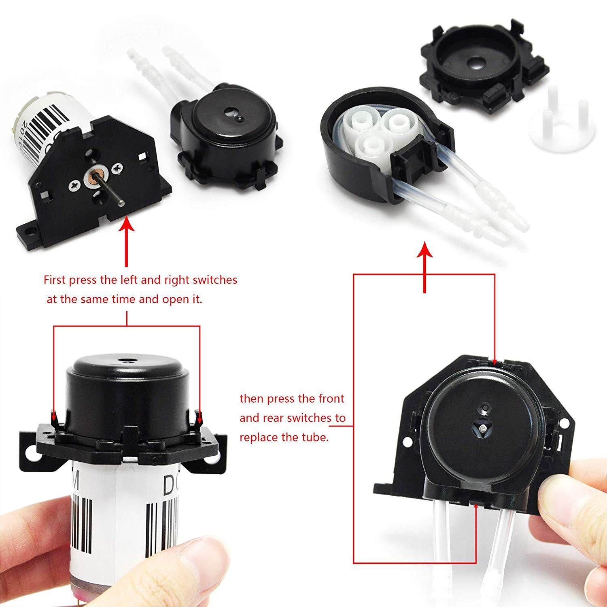
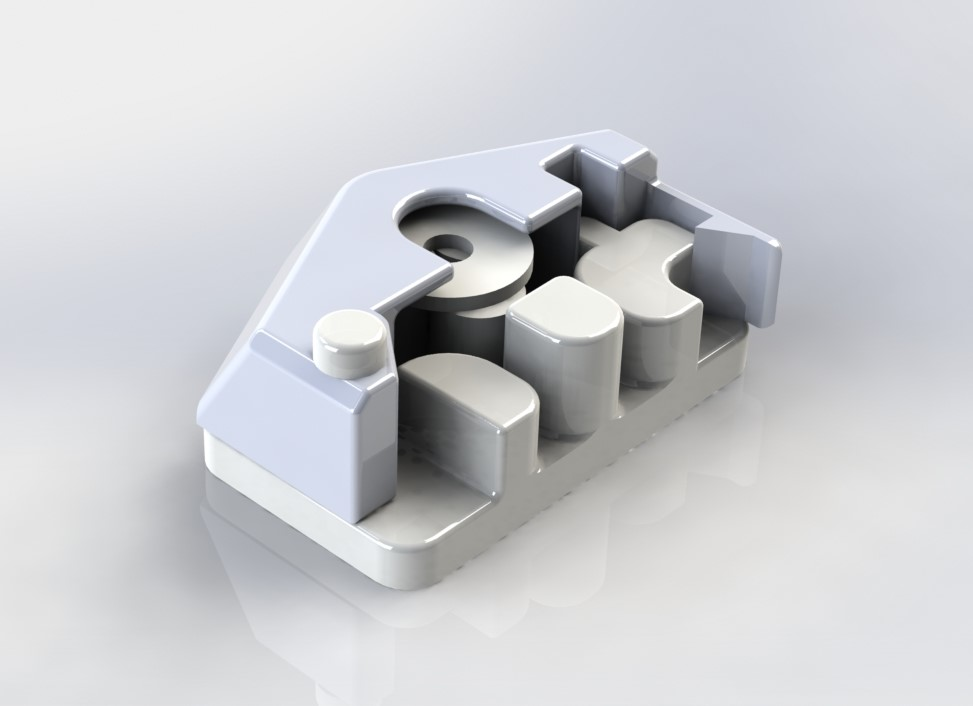
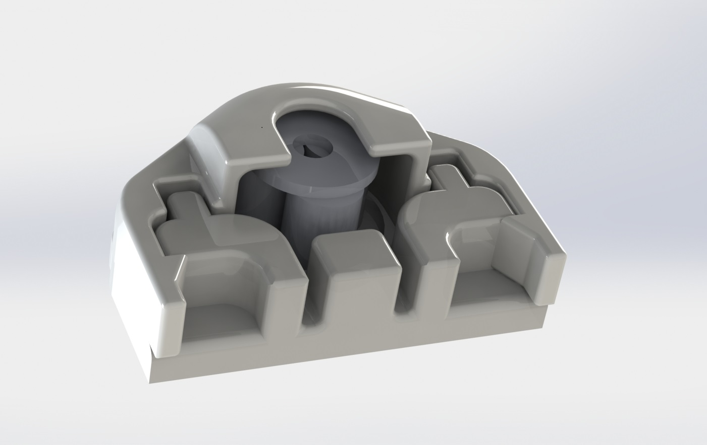

#### Role
Designer

## Summary

Prior to my arrival, the cheapest peristaltic pump available was sourced; in an attempt to make it usable, I spent time redesigning the pump head. The original pump head design was problematic and prone to failure and the tubing was extremely tedious and challenging to remove. To solve a lot of these problems, I redesigned the pump head and 3d printed out new revisions. The pump head was optimized to reduce flow, and improve ease at which the tubing can be changed. This pump design never made it into the final product design as it was too unreliable for production use.

## Photos

*Fig. 1: Pump as supplied showing numerous, tiny pieces that fall apart easily and are challenging to use*

*Fig. 2: Rev 3 pump render*

*Fig. 3: Rev 7 pump render*

## Videos

*3D printed Rev 7 pump housing running and pumping at needed low volumes of water*
