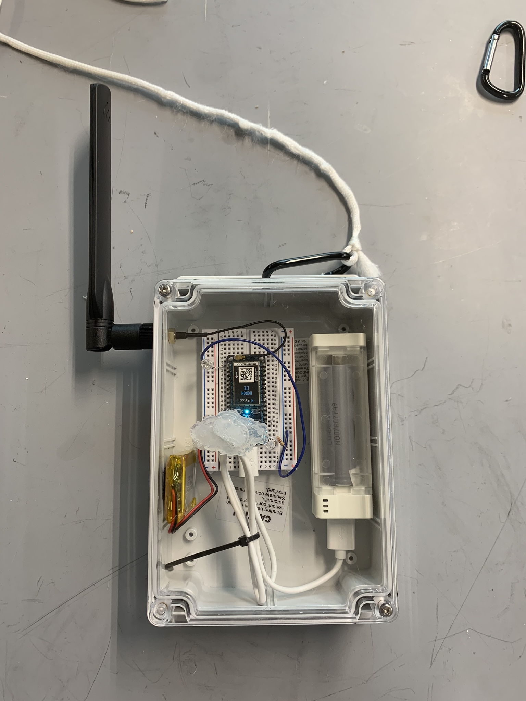
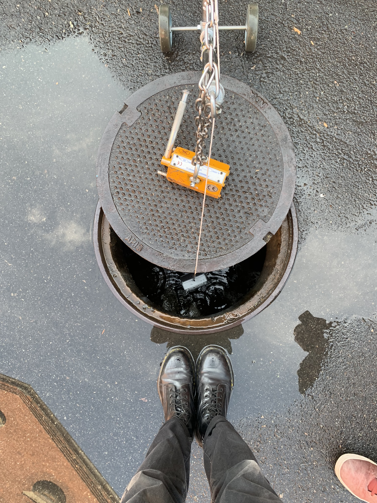

`youtube: n7Q2LO8Xu4A`

*Rob KillKelley demonstratin  g wireless communication to sampling device*

#### Role
Engineer

## Summary

Directed and led team to develop a simple waterproof test box that enabled communication from a manhole. Long thought to be impossible due to the assumption that the subterranean communication would be hindered by the manhole cover and thick cement walls, an informal Faraday cage; despite this assumption, we found an antenna and cellular enabled micro-controller configuration that allowed us to communicate from a manhole, from up to 5 ft deep. The tech developed in our mini-testbox was then grafted onto an existing gamma build unit and demonstrated that wireless communication can be enabled from an actual sampling device.

## Photos

*Fig. 1: A revision of the sample testing box with dual batteries, this box went through many revisions to determine ideal combination of wireless comms hardware*

*Fig. 2: Example of test condition: partial manhole coverings. Test conditions do not permit
