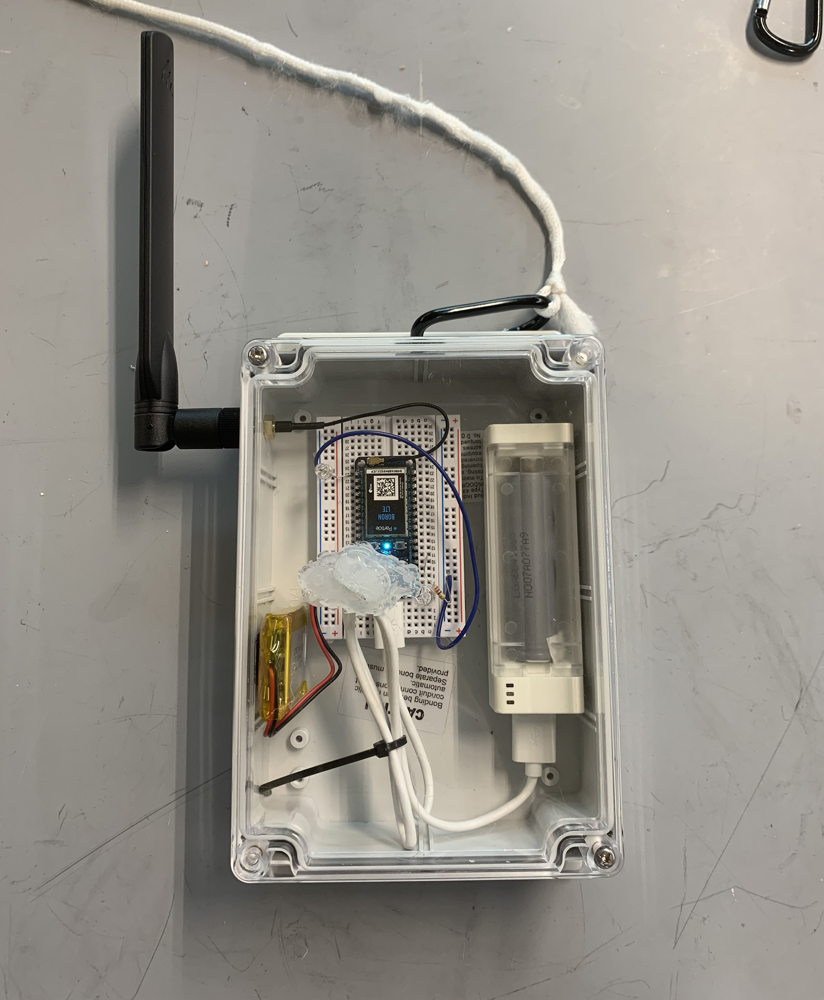

#### Role
Manager

## Summary

Directed and supported electromechanical engineer to develop a simple waterproof test box that enabled communication from a manhole. Long thought to be impossible, we found an antenna and cellular enabled micro-controller configuration that allowed us to communicate from a manhole, from up to 5 ft deep. The tech developed in our mini-testbox was then grafted onto an existing gamma build unit and demonstrated that wireless communication can be enabled from an actual sampling device.

## Photos

*Fig. 1: A revision of the sample testing box with dual batteries, this box went through many revisions to determine ideal combination of wireless comms hardware*

*Fig. 2: Example of partial manhole covering to determine communication under various test conditions. With a full manhole covering, a faraday cage prevented most transmissions. But a few different combinations of test devices were found to be able to communicate effectively.*

## Videos

*Rob KillKelley demonstrating wireless communication to sampling device*
