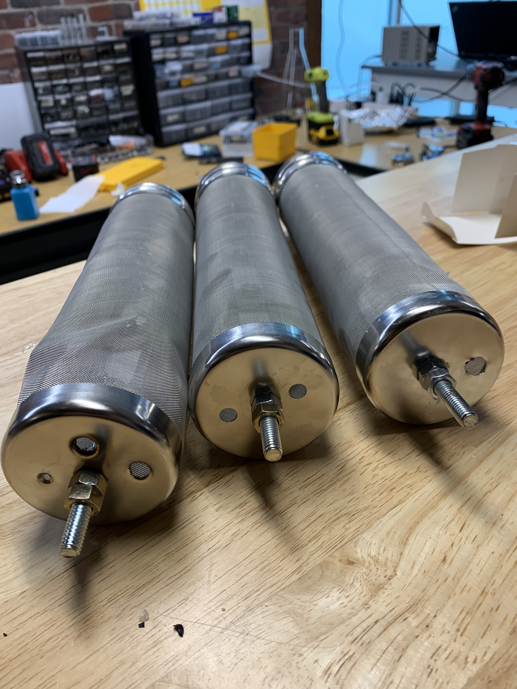
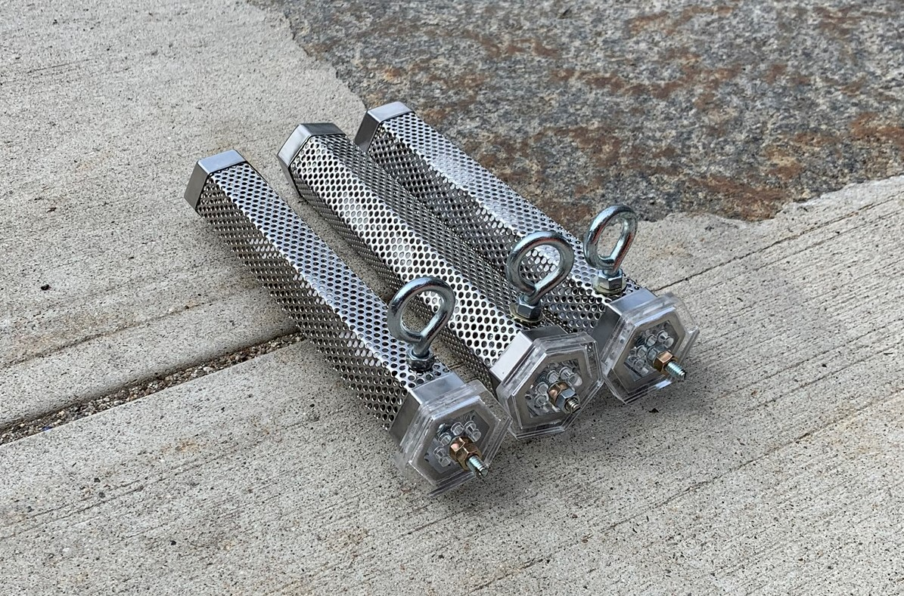

#### Role
Designer

## Summary

As an alternative to the costly hardware sampler, a passive sampler was also developed based on a similar chemical sampling premise. The sampler in question was called a POCIS. Different stainless steel mesh devices were purchased from Amazon and we mounted purchased POCIS samplers within these mesh devices.

## Photos

*Fig. 1: Rev 1 POCIS, very difficult to manufacture as drilling into the soft but case hardened stainless steel was problematic due to the weak structure. Case was designated as a "beer hopper" for homebrew use.*

*Fig. 2: Rev 2 POCIS, much easier to manufacture with custom laser cut end caps on one side and added eyelets to the sidewall. Case was designated as "wood chip smoker" for barbeque use.*

## Videos

*Team install of POCIS in Cambridge manhole*
