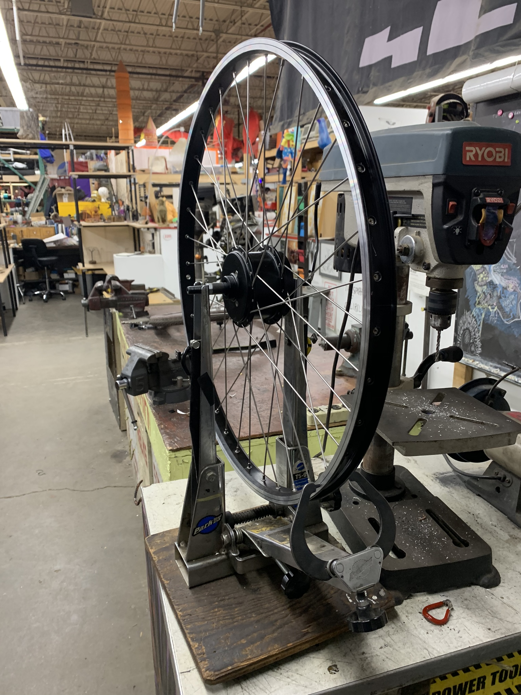
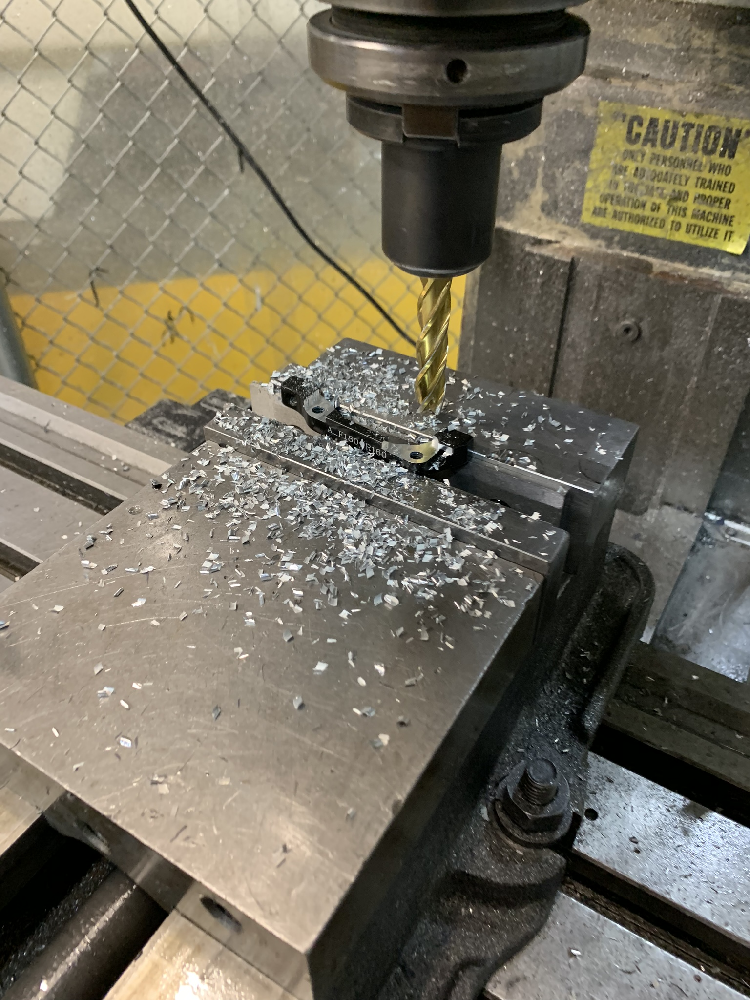
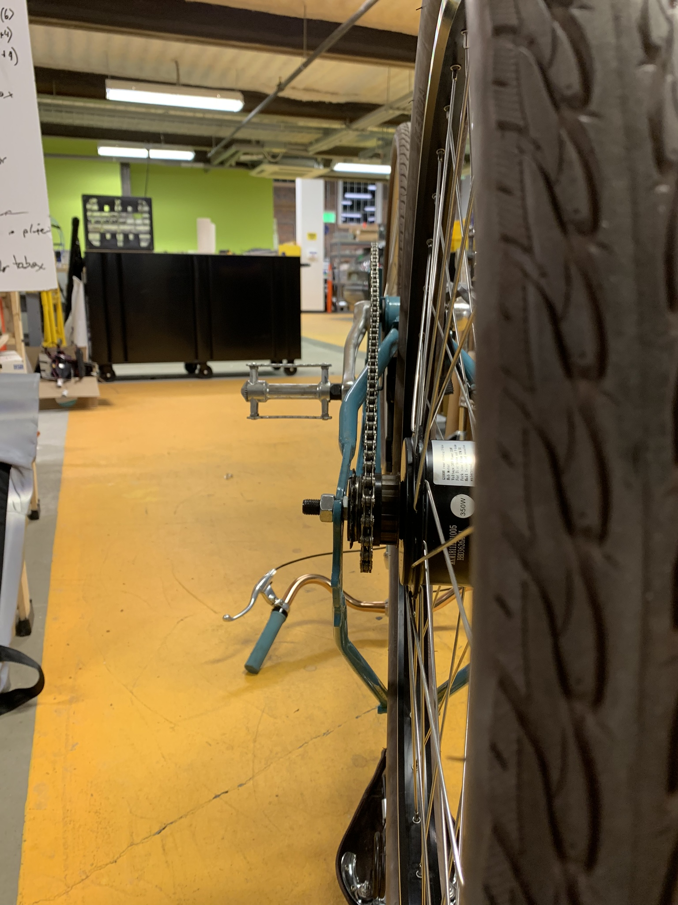
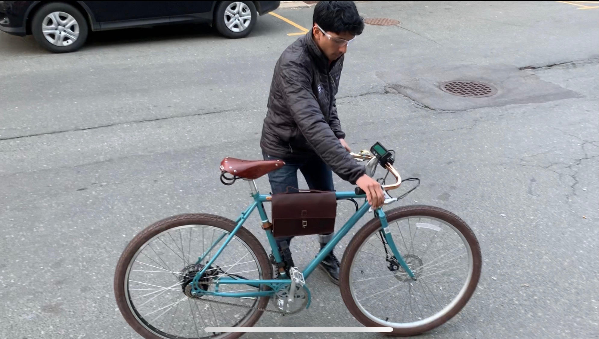

`youtube: fR6uySCIAOo`

*Demo of e-bike near Greentown Labs, super fun ride!*

## Summary

As any good MechE would do, I built myself an e-bike. But instead of sticking with the classic mainstays of cheap, unused bike with an assortment of electrical fixtures. I pursued a stealth build that required a bit of custom fabrication to get just right. The bike uses a small 16s1p, 60V nominal, 3Ah LiPo battery pack, a custom controller from Edward of Lyen Controllers, and a Cycle Analyst V2 computer. Peak power output of 1.5kW through a hub designed for 350w means that power output needs to be current controlled. The design was unconventionally optimized for high voltage but low current draw due to this limitation, typical e-bikes ride with either a 36V or 48V nominal system. To account for a target speed of ~25mph, at a target power draw - I choose to use significantly higher voltage but limit the current. The system rides very well but I will be switching to a direct drive hub as the system is capable of much, much better performance at the expense of some aesthetics (direct drive hubs are much bigger and heavier, but don't have fragile planetary gears or freewheel clutches).

*Specs:*
Max Speed: 26MPh
Distance: 5mi
Acceleration: ??

## Photos

*Fig. 1: Custom wheel built to house the smallest hub motor available on the market, rated for 350w.*

*Fig. 2: Completed wheel on truing stand in the Skul space in Artisan's Asylum, double cross spoke pattern*

*Fig. 3: Machining disc brake caliper bracket as the hub was significantly wider than the original hub. Milling down bolt attach points enabled me to move the caliper 0.15" outwards from the center plane.*

*Fig. 3: Custom spacers were turned on the lathe to get proper chain alignment on a 7-speed freewheel hub that I converted to a single speed freewheel.*

*Fig. 4: Completed bicycle after test ride*
