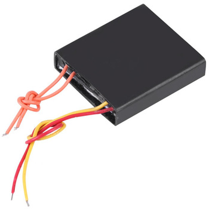

## Summary

One day whilst working on some solid modelling a package came across my desk with no discernible or obvious origin, other than the fact that it was addressed to me. Inside were 10 black boxes with 4 wires attached to each. It was peculiar to say the least. Thinking nothing of it, I filed it away on the shelf for future evaluation. Months later I spend some time and come to find they were high voltage generators, the trickiness was figuring out what they were:

Method:

1. Probed contacts and took resistance readings
2. Googled key words of "black box, 4 wires"
3. Attempted to search for Chinese characters indicated on side to no avail
4. Returned back to the multimeter and voltage analysis
5. Surmised that the red and yellow leads could be related to a power source
6. Set up power supply with low current cut-off, connected leads to power supply, and was pleasantly surprised by a brilliant ignition spark

Following this adventure, I made it into a hand held high voltage generator.

## Photos

*Fig. 1: After finding out purpose, here is a picture from the AliExpress site, must have been sent erroneously by a supplier there.*
