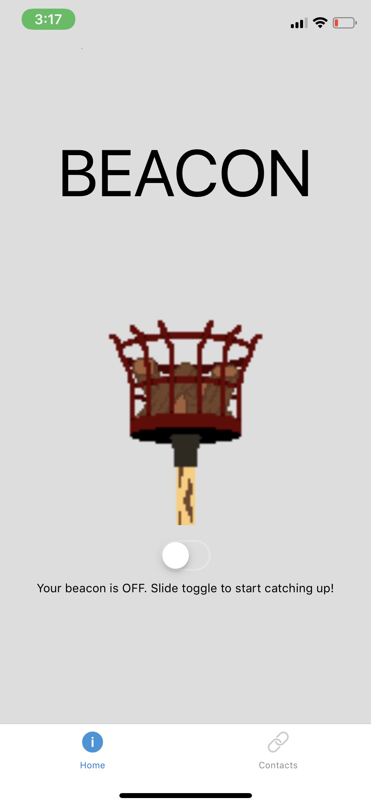
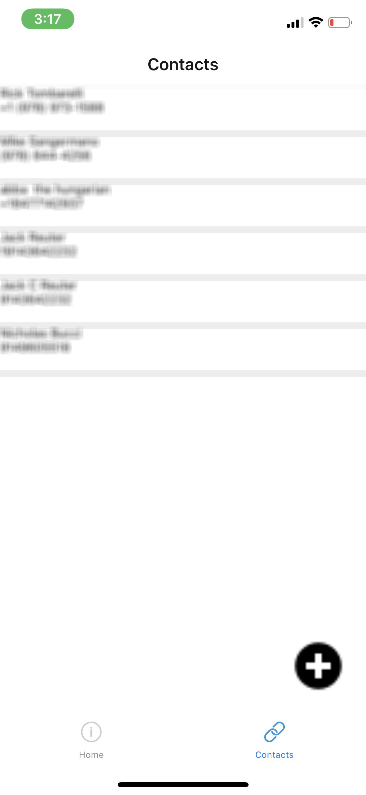

## Summary

Growing up I moved around a lot, and found it impossible to stay in touch. Facebook and Instagram were huge when they came out as they served as a constant reminder of people I once spent a lot of time with. The challenges of staying in touch have always been on my mind, and recently I came up with a potential solution that might solve that problem in a slightly unconventional way.

Beacon is an app I conceived of to bring people together. The app is simple: add a few contacts — family, close friends, people you enjoy talking to from all walks of life — then turn on your Beacon. If a friend adds you to their contact list and turns their Beacon on as well, the app will auto connect you for a phone call. An example of a use case would be; driving in a car, you’re listening to the radio, but you turn your Beacon on for the ride, so you get a call from your 11th grade teacher who wrote you that recommendation letter to get you into college. You talk and catch up. Then after the call you can rate the caller, “How soon would you like to speak with them again?“. From that data we build an algorithm to refine your calling habits and enable more meaningful connections.  [Jack Reuter](https://github.com/jackreuter) is the primary developer and I created the vision and design.

## Photos

*Fig. 1: Beacon alpha revision, welcome screen*

*Fig. 2: Beacon alpha revision, contact screen*
