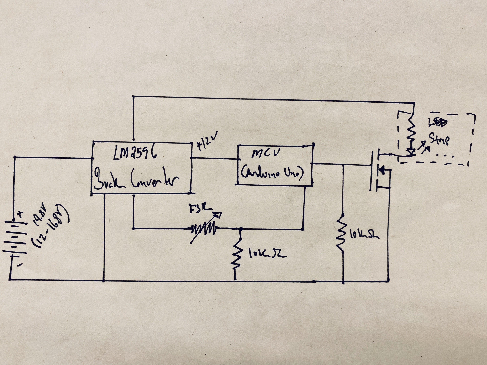
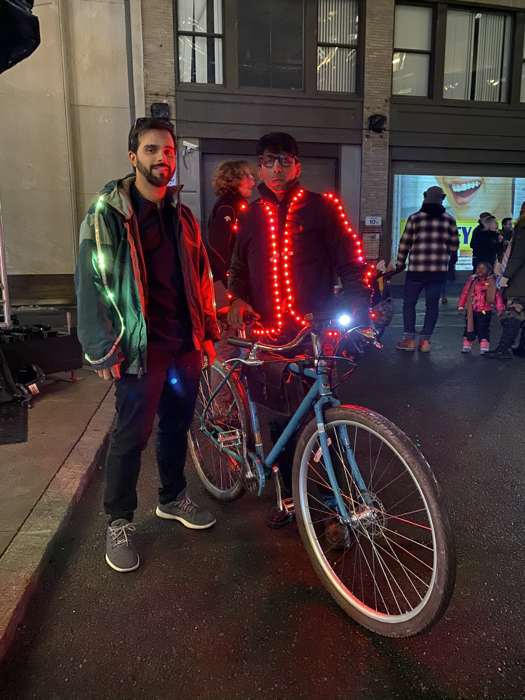

## Summary

My friend wanted to go to a light festival, and so we went illuminated. We chose projects the night before and had a hackathon the night before. The jacket reflects the breathing of the user, as a cyclist I want to remind people I am not just a glowing LED dot, hovering in the night, I am a living, breathing human - please do not drive cautiously!

## Photos

*Fig. 1: Breathing in and out, early prototype using addressable LEDs and a Teensy 3.2 to control them*

*Fig. 2: Circuit design, did not include voltage cutoff for battery, really should have, BUT I used a 3Ah battery that had plenty of energy for the duration of the event.*

*Fig. 3: Completed circuit*

*Fig. 4: Jason Chrisos and I at the festival, pictured: [Electric Bike Project](https://niklal.me/ebike/)*
