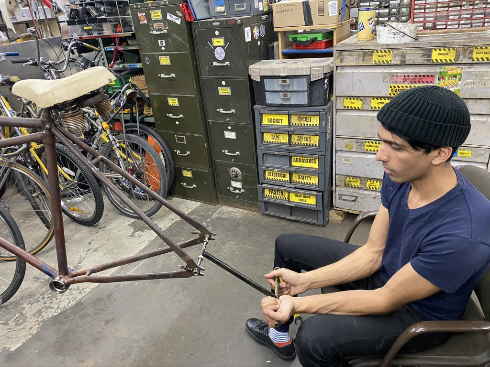
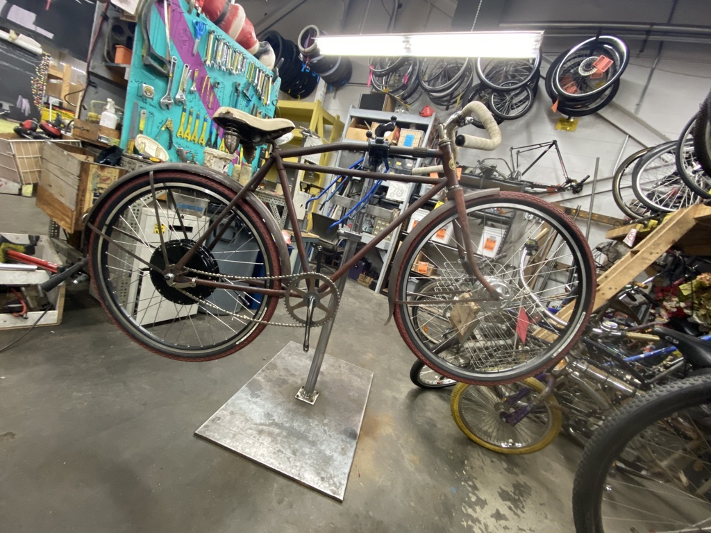

## Summary

A work in progress, this is my antique motor-bicycle, built sometime between 1917-1922. The bicycle was purchased without wheels, yet came with a skip tooth chain with odd-sized pitch. I added custom wheels, a direct drive rear hub from ebikekit and a Sturmey-Archer front drum brake, built a front brake sensor out of a hard drive magnet and a hall effect sensor, used old batteries from Biobot, and various other parts I had lying around.

*Specs:*
Max Speed: 28MPH
Distance: 6mi
Acceleration: 0-25MPH, 4s
Max Current: 30A
Max Voltage 66V

## Photos

*Fig. 1: Frame was only ~100mm rear spacing, so I stretched it to 135mm to accommodate the modern direct drive hub.*

*Fig. 2: Wheels fitted up, scavenged front chainring and single piece crank from Scul - chain droop was fixed on a later date.*
