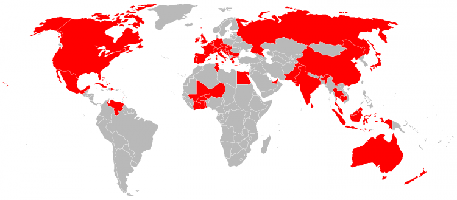
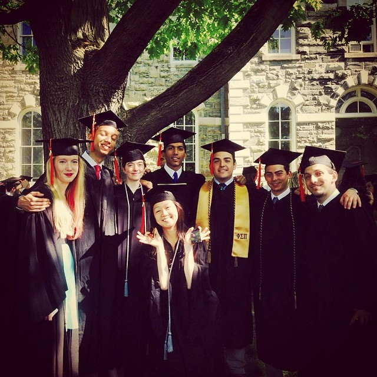
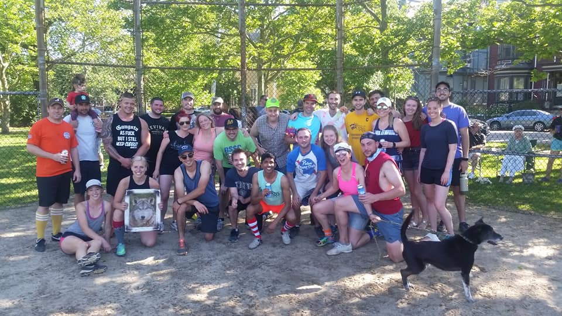
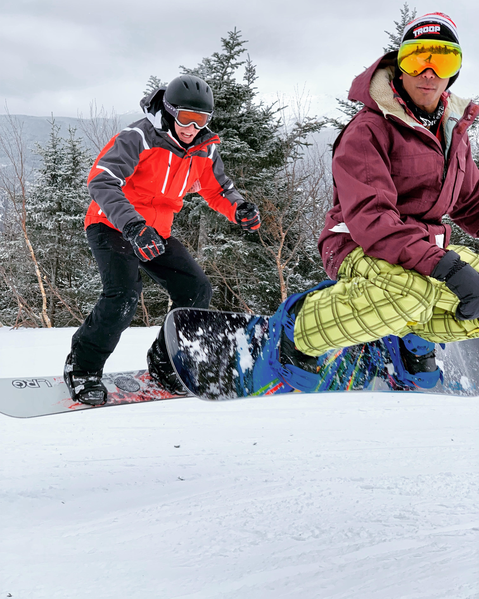
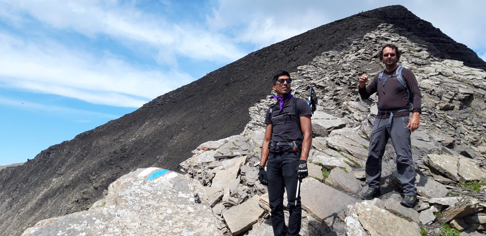

### General
A consummate engineer, I have always enthusiastically pursued science and research from a young age. Never one to stop learning, when I'm not working, I devour industry level research on macro trends, hang out with friends, and spend as much time as I can outdoors. Experienced mechanical focused hardware engineer, with an emphasis on prototyping hardware and leading small teams to develop significant projects.

### Background

Born in Maryland, I followed my mother around the world as she served the US Department of State as a diplomat. Spending time in Africa, Asia, and Europe - I've never known truly where to call home, but I do have a strong appreciation for other people and their cultures. Having visited 58 countries, I feel enormously grateful to have had such a holistic upbringing.

## Education

I received a Bachelor's degree in Mechanical Engineering and a Master's degree in Systems Engineering with a focus in entrepeneurship from Cornell University (Ithaca, NY).

### Sports

I spend as much time as I can outside, hiking, climbing, mountain biking, and snowboarding are my seasonally dependent go-to's. I've participated in a variety of club sports over the years, including soccer, tennis, dodgeball, and as the founder of the Fox Point Booters. A competitive league team in Providence, RI.

*
[Fox Point Booters](https://www.instagram.com/foxpointbooters/), on a dusty field in Providence RI*

*
Somewhere on Cannon Mountain, NH.*

*
Near the summmit of the Schwarzhorn in the Bernese Oberland.*

### Hobbies

When I'm not outside I spend a lot of my time buried in papers, videos, and instructional documentation in engineering and determining engineering solutions to major world problems. I also enjoy a good game of darts, foosball, or pool.
